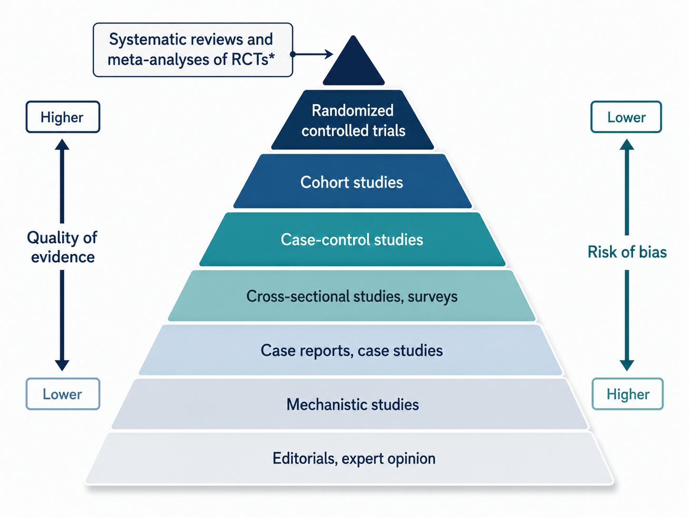
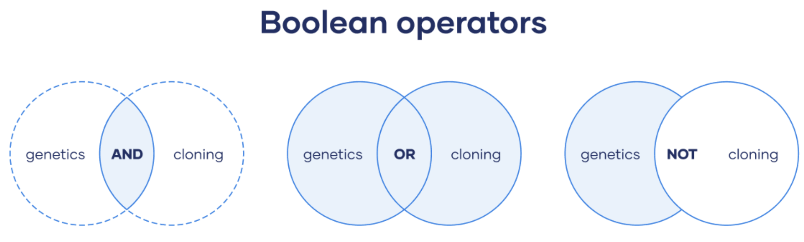
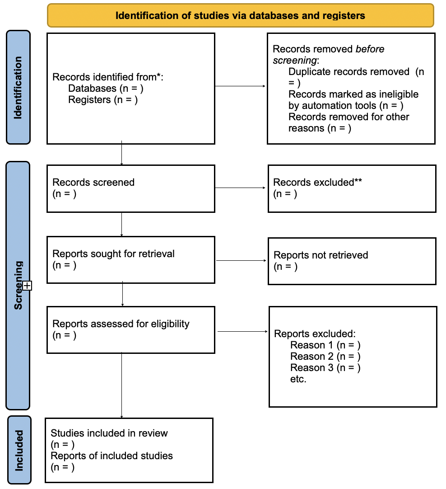
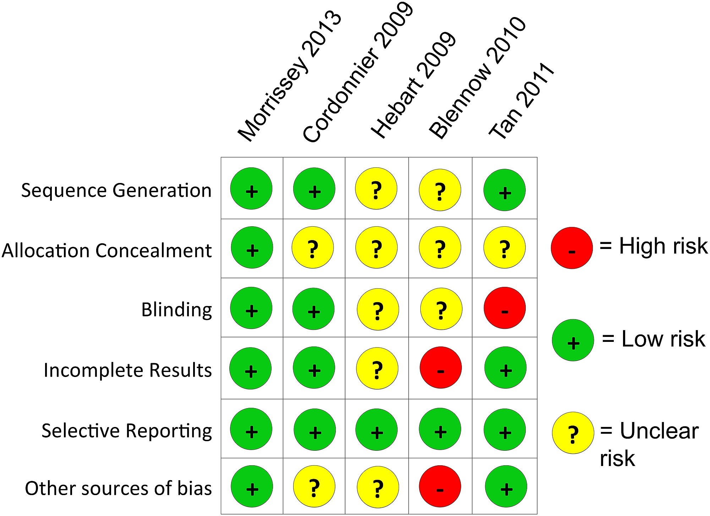

## Che cos'è una Systematic Review?

::::: columns
::: {.column width="55%"}
 

> **È una sintesi strutturata della ricerca esistente.**

 

**Caratteristiche**

-   Parte da una domanda di ricerca chiara

-   Usa metodi espliciti per cercare, selezionare e valutare gli studi

-   Produce una sintesi trasparente e riproducibile
:::

::: {.column width="45%"}
  

{fig-align="center" width="100%"}
:::
:::::

------------------------------------------------------------------------

## Perché fare una Systematic Review?

 

-   Prima di fare una nuova ricerca, dobbiamo sapere cosa esiste già

-   La letteratura cresce più velocemente della nostra capacità di leggerla

-   Singoli studi possono essere fragili, incompleti o contraddittori

 

> **Le Systematic Review aiutano a trasformare molti studi in una sintesi accessibile**.

------------------------------------------------------------------------

## Cosa permette di fare una Systematic Review?

 

-   Riassumere lo stato attuale delle conoscenze

-   Capire se una domanda ha già una risposta abbastanza robusta

-   Identificare risultati coerenti, contraddizioni e lacune

-   Informare nuove ricerche, pratica clinica, policy e linee guida

------------------------------------------------------------------------

## Quando è particolarmente utile?

 

-   Quando molti studi rispondono a domande simili

-   Quando i risultati sembrano discordanti

-   Quando si vuole progettare un nuovo studio

-   Quando una decisione pratica richiede una sintesi affidabile

 

> **Domanda: prima di iniziare un nuovo studio, controllate sempre se esiste già una review recente?**

------------------------------------------------------------------------

## Systematic Review e Meta-Analisi

 

> **Una meta-analisi è una sintesi quantitativa dei risultati di studi diversi.**

 

-   Una meta-analisi dovrebbe sempre poggiare su una systematic review

-   La review definisce quali studi entrano nell'analisi

-   La meta-analisi stima quanto è grande, preciso e variabile un effetto

-   ***Senza review sistematica, aumenta il rischio di bias e cherry picking***

------------------------------------------------------------------------

## Non tutte le review sono uguali

 

> **Systematic review:** risponde a una domanda specifica con metodo riproducibile e sistematico

 

-   **Narrative Review:** descrizione qualitativa della conoscenza su un dato ambito (non adotta criteri espliciti-sistematici per selezionare gli studi)

-   **Scoping review:** mappa aspetti metodologici di un'area di ricerca

-   **Meta-analisi:** combina quantitativamente effect sizes comparabili

-   **Umbrella review:** sintetizza risultati da più systematic review/meta-analisi

------------------------------------------------------------------------

## Systematic Review - Come si fa?

 

### Passaggi principali

1.  Definire la domanda di ricerca

2.  Scrivere e preregistrare il protocollo

3.  Cercare gli studi in modo sistematico (*screening*)

4.  Selezionare gli studi con criteri espliciti e trasparenti (*selection*)

5.  Estrarre i dati di interesse (*extraction*)

6.  Sintetizzare i risultati

------------------------------------------------------------------------

## 1. Definire la domanda di ricerca

 

**Criteri PICO**

-   **P** = Population \| partecipanti

-   **I** = Intervention \| esposizione / predittore

-   **C** = Comparison \| gruppo di controllo

-   **O** = Outcome \| esito principale

 

> **Le Systematic Review nascono in ambito clinico, ma si possono espandere a più ambiti di ricerca.**

------------------------------------------------------------------------

## 2. Preregistrazione del protocollo

:::::: columns
::: {.column width="64%"}
-   Registrazione in anticipo di: domanda, criteri e metodi

-   La pre-registrazione rimuove il rischio di decisioni post-hoc

-   Rende trasparente eventuali deviazioni dal piano iniziale

**Dove caricarla**

-   [**PROSPERO**](https://www.crd.york.ac.uk/prospero/): registro di protocolli per systematic review

-   [**Open Science Framework**](https://help.osf.io/article/330-welcome-to-registrations): principale database di pre-registrazioni
:::

:::: {.column width="36%"}
 

::: image-stack
 
:::
::::
::::::

------------------------------------------------------------------------

## 3. Screening della letteratura

 

### Team di ricerca

 

> **Idealmente almeno 3-4 persone**

 

-   Due/tre reviewer indipendenti per screening ed estrazione dati

-   Un terzo reviewer o supervisore per risolvere disaccordi

------------------------------------------------------------------------

## 3. Screening della letteratura

:::::: columns
::: {.column width="64%"}
 

### Database principali

-   **PubMed / MEDLINE**: biomedicina e salute

-   **PsycInfo**: psicologia

-   **Web of Science**: database multidisciplinare

-   **Scopus**: ampia copertura bibliografica

 

> **La scelta dipende dalla domanda di ricerca**
:::

:::: {.column width="36%"}
::: database-stack
  
:::
::::
::::::

------------------------------------------------------------------------

## 3. Screening della letteratura

### Search Query

{fig-align="center"}

-   **Virgolette**: per cercare una frase esatta

-   **Troncamento**: per recuperare varianti della stessa radice

> **Esempio**: `("post-traumatic stress" OR PTSD) AND (EMDR OR "eye movement desensitization") AND (child* AND adolesc*)`

------------------------------------------------------------------------

## 3. Screening della letteratura

 

### Letteratura grigia

-   Include report, tesi, preprint, atti di conferenze

-   Riduce il rischio di publication bias

 

### Fonti principali

-   [Grey Matters](https://greymatters.cda-amc.ca/)

-   [GreyNet](https://www.greynet.org/)

-   [Open Science Framework](https://osf.io/)

------------------------------------------------------------------------

## 4. Selezione degli studi

:::::: columns
::: {.column width="70%"}
-   **I Step**: selezione sulla base di titolo e abstract

-   **II Step**: valutazione dell'intero testo degli articoli

> **Le decisioni dovrebbero essere indipendenti e documentate**

 

**Risorse utili**

-   Flow diagram [**PRISMA**](https://www.prisma-statement.org/)

-   [**Covidence**](https://www.covidence.org/): supporto per screening ed estrazione dati
:::

:::: {.column width="30%"}
::: image-stack

:::
::::
::::::

------------------------------------------------------------------------

## 5. Estrazione dei risultati & valutazione bias

 

-   Si estraggono caratteristiche di: studio, campione, intervento e outcome

-   [**Risk of Bias**](https://sites.google.com/site/riskofbiastool/welcome/rob-2-0-tool) e/o [**GRADE**](https://www.cochrane.org/learn/courses-and-resources/cochrane-methodology/grade) valutano la credibilità interna degli studi inclusi

> **La qualità degli studi influenza la fiducia nei risultati.**

{fig-align="center"}

------------------------------------------------------------------------

## 6. Sintetizzare e riportare i risultati

 

-   Organizzare gli studi inclusi in modo chiaro e trasparente

-   Descrivere caratteristiche, risultati e differenze tra gli studi

-   Evidenziare pattern comuni, risultati contrastanti e lacune

 

::: {style="text-align: center; margin: 0 auto; width: 50%; border: 2px solid #528B8B; padding: 4px; border-radius: 8px; background-color: #98F5FF; font-size: 0.80em;"}
**Next step** (se possibile) → **Meta-Analisi**
:::

 

> **L’obiettivo è trasformare molti studi in una sintesi leggibile e replicabile**

------------------------------------------------------------------------

## In sintesi

 

-   La letteratura cresce più velocemente della nostra capacità di leggerla

-   Le Systematic Review aiutano a trasformare molti studi in una sintesi ordinata

-   Una meta-analisi è valida solo quanto lo è la review su cui si basa

-   Metodo, pre-registrazione e trasparenza proteggono da bias e cherry picking

-   L’obiettivo finale è produrre evidenza utile per ricerca, pratica e decisioni
